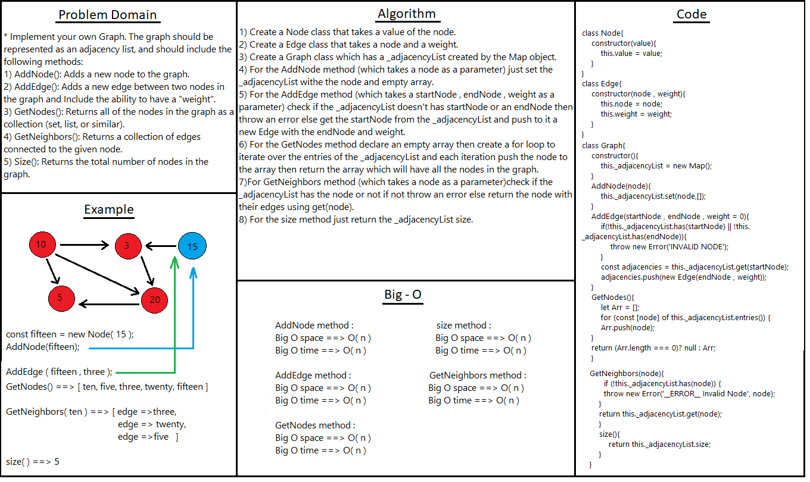

# Graph

* Creating a graph with the basic metheds needed.

## Challenge

Dealing with the Map object.

## Approach & Efficiency
<!-- What approach did you take? Why? What is the Big O space/time for this approach? -->

## API
<!-- Embedded whiteboard image -->

1) AddNode method : Adds a new node to the graph.
2) AddEdge method : Adds a new edge between two nodes in the graph.
3) GetNodes method : Returns all of the nodes in the graph as a collection in an array.
4) GetNeighbors method : Returns a collection of edges connected to the given node.
5) size method : Returns the total number of nodes in the graph.

## Test 

* To test it in the terminal run the command npm test graph.

## Solution
