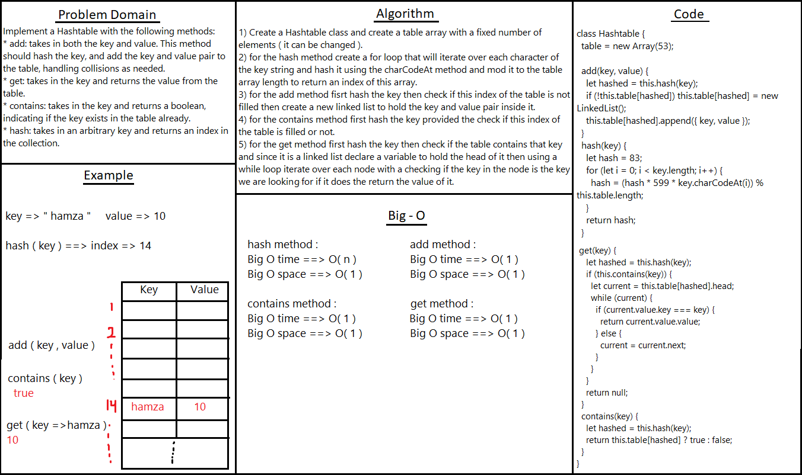

# Hash Tables

* Creating a hashtable with the basic metheds needed.

## Challenge

Creating the best hashing method.

## Approach & Efficiency
<!-- What approach did you take? Why? What is the Big O space/time for this approach? -->

## API
<!-- Embedded whiteboard image -->

1) hash method : takes a key and returns an index in the collection.
2) add method : takes in both the key and value and add the key and value pair to the table.
3) contains method : takes in the key and returns a boolean, indicating if the key exists in the table or not.
4) get method : takes in the key and returns the value from the table.

## Test 

* To test it in the terminal run the command npm test hashtable.

## Solution
