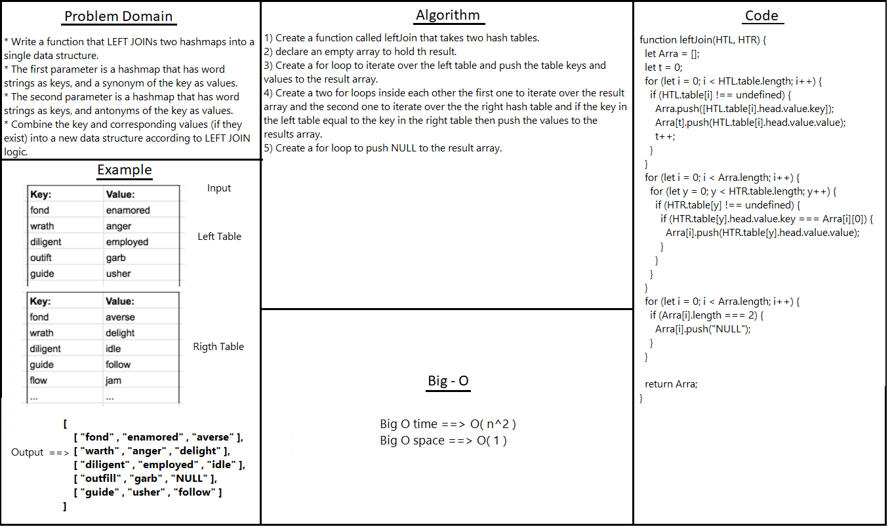

# Left Join

* Implement a simplified LEFT JOIN for 2 Hashmaps

## Challenge

## Approach & Efficiency
<!-- What approach did you take? Why? What is the Big O space/time for this approach? -->

## API
<!-- Embedded whiteboard image -->
leftJoin function : Combine two hash tables a new data structure according to LEFT JOIN logic.

## Test 

* To test it in the terminal run the command npm test left-join.

## Solution
