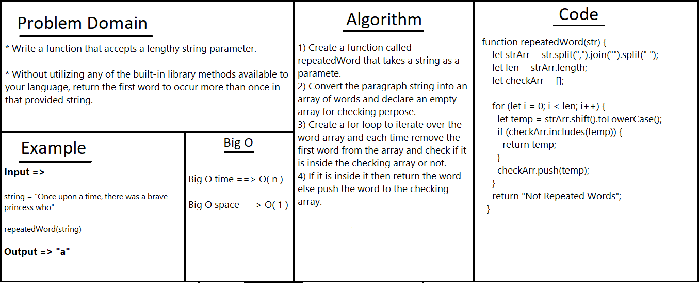

# Repeated Word

* reutrn the first word which is repeated twice.

## Approach & Efficiency
<!-- What approach did you take? Why? What is the Big O space/time for this approach? -->

## API
<!-- Embedded whiteboard image -->

* repeatedWord function : iterate over the paragraph string and return the first repeated word.

## Test 

* To test it in the terminal run the command npm test repeared-word.

## Solution
