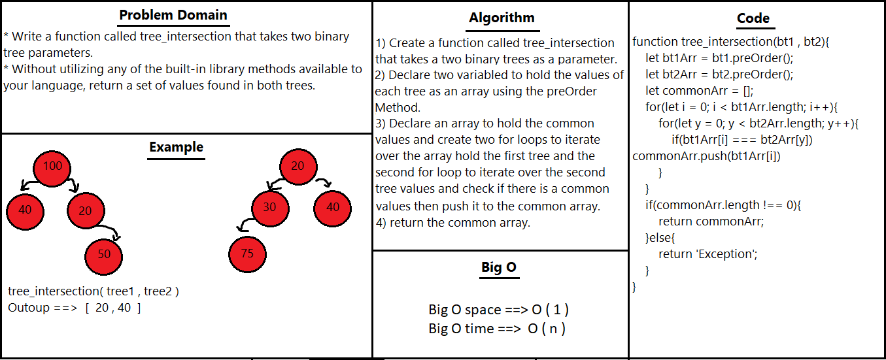

# Tree Intersection

return a set of values found in both trees.

### BinarySearchTree
* add(value): space O(1)/time O(n)
* contain(value): space O(1)/time O(n)

## API
* tree_intersection function : takes two binary trees and return the values found in the both trees as an array.

## Test 
* To test it in the terminal run the command npm test tree-intersection.
## Solution
